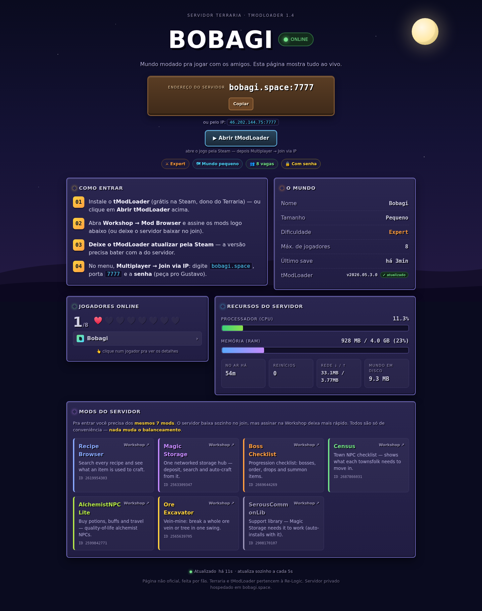

# terraria-status — live status page for a tModLoader server

**English** · [Português](README.pt-BR.md)

A **zero-dependency Node.js status page** for a modded Terraria (**tModLoader**) dedicated
server running in Docker. It shows, live and auto-refreshing:

- 🟢 Server **online/offline**, uptime, restarts
- 👥 **Players online** (names, no IPs) and free slots — **click a name for a character modal** (see below)
- 📊 **CPU / RAM** of the server container, network I/O, world size on disk
- 🗺️ World info (name, size, difficulty, last save) and the **running tModLoader version**
- 🔺 **Out-of-date warning**: compares the running version against the latest stable release on GitHub and flags it explicitly when the server is behind
- 🧩 The server's **mod list** with Steam Workshop links
- 🎮 A **"Launch tModLoader"** button (`steam://run/1281930`) and copyable server address

Live example: **https://terraria.bobagi.space**



Built as a companion to the
**[Terraria tModLoader Ubuntu Server guide](https://github.com/Bobagi/Terraria-tModLoader-Ubuntu-Server)** —
follow that first to get the server itself running.

## How it works

```
players ──HTTPS──▶ nginx ──▶ Node (127.0.0.1:3063) ──docker CLI──▶ tmodloader container
                             │  static page + /api/status (cached JSON)
                             └─ polls: docker stats/inspect · inject "playing" · du
```

- A single `server.js` (no npm packages) polls Docker on timers and caches a JSON
  snapshot; browsers poll `GET /api/status` every 5 s.
- Players online come from the server console: `docker exec <container> inject "playing"`,
  then reading the reply via `tmux capture-pane` (the JACOBSMILE image runs the console
  in tmux). **Not** `docker logs --tail` — that gets slow as the log file grows.
- It runs **on the host, not in a container**, on purpose: it needs the `docker` CLI, and
  mounting `docker.sock` into an internet-facing container would be a much bigger risk.

## Requirements

- The tModLoader server from the guide (JACOBSMILE image; the `inject` helper + tmux
  console come with it)
- Node.js ≥ 18, a process manager (PM2 shown), nginx + certbot for HTTPS

## Install

```bash
git clone https://github.com/Bobagi/terraria-status.git /opt/terraria-status
cd /opt/terraria-status

# adjust config (see table below), then:
pm2 start server.js --name terraria-status
pm2 save
```

nginx vhost (then `certbot --nginx -d status.example.com`):

```nginx
server {
    listen 80;
    server_name status.example.com;
    location / {
        proxy_pass http://127.0.0.1:3063;
        proxy_set_header Host $host;
    }
}
```

## Configuration (environment variables)

| Variable         | Default                                 | What it is                          |
|------------------|-----------------------------------------|-------------------------------------|
| `STATUS_PORT`    | `3063`                                  | HTTP port (keep behind nginx)       |
| `STATUS_BIND`    | `127.0.0.1`                             | Bind address — **keep localhost**   |
| `TMOD_CONTAINER` | `tmodloader`                            | Server container name               |
| `TMOD_DATA_DIR`  | `/opt/terraria-tmodloader/data/tModLoader` | The server's data volume         |
| `TMOD_WORLD`     | `Bobagi`                                | World name (for the `.wld` file)    |
| `TMOD_WORLD_SIZE`| `Small`                                 | Shown on the page                   |
| `TMOD_DIFFICULTY`| `Expert`                                | Shown on the page                   |
| `TMOD_MAXPLAYERS`| `8`                                     | Player slots                        |
| `SERVER_HOST`    | `bobagi.space`                          | Address players type                |
| `SERVER_IP`      | `46.202.144.75`                         | Shown as fallback address           |
| `SERVER_PORT`    | `7777`                                  | Game port                           |

The **mod list** shown on the page is the `MODS` array at the top of `server.js` — edit it
to match your server's `TMOD_ENABLEDMODS` (name, Workshop ID, one-line description).

## Character stats (optional)

Click a player's name and a modal opens. Out of the box it shows **who** they are
and **how long** they've been online (derived from the console, no mod needed).

To also show **health, mana, defense, equipped gear, inventory and buffs**, run the
server-side mod in [`character-stats-mod/`](character-stats-mod/) — **it's enabled on
the live demo**, and a prebuilt `.tmod` + one-command headless build are included. It
writes `playerstats.json` to the save directory every few seconds and this app reads it.

Key points (full details in the mod's README):

- It's **`side = Server`** — **players don't need it**, it doesn't change the required
  modlist, and nobody gets kicked for not having it.
- A vanilla tModLoader server exposes **only names** over its console; there's no
  built-in API for character data, and **tShock's REST API is incompatible with
  tModLoader**. A small server-side mod is the only route.
- **"Level" isn't a Terraria concept** unless you also run an RPG/leveling mod.

Until the mod is enabled, the modal shows a short note explaining this — the site
works fully without it.

## Security notes

- The tModLoader console log **contains your server password** (the image prints its
  config at boot). This app **never returns raw log lines** — it extracts player names
  only, and **strips anything that looks like an IP** before publishing.
- The page never shows the password (it says "password-protected"; players ask you).
- Keep the Node process bound to `127.0.0.1` and TLS-terminate with nginx.
- Malformed request paths are rejected (no traversal outside `public/`, no crash on bad
  percent-encoding).

## License

[MIT](LICENSE)
